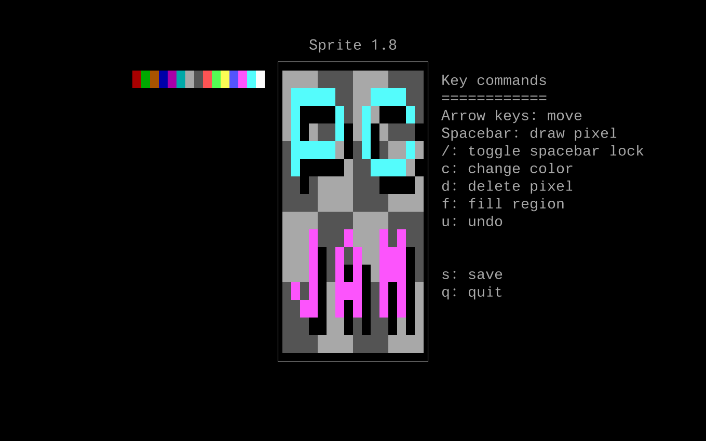

sprite for MS-DOS
=================
This branch of `sprite` targets 16-bit MS-DOS.

`sprite` is a text-mode program that allows you to do some simple
sprite work for your retro video game development. It works in
textual 80x25 mode with 16 colors.

By default, `sprite` sets up a 16x16 pixel canvas.
If you'd like a smaller 8x8 pixel canvas, start sprite with the `/s`
option.

This version of `sprite` was written for
[PCjam 2021](https://pcjam.gitlab.io/).

Requirements
------------
You will need the Open Watcom v2 compiler and PDCurses.

Building
--------
First, you will need to build
[PDCurses](https://pdcurses.org/).
I built PDCurses with the large memory model and added `-0 -ox` to its
`CFLAGS`. After building PDCurses, copy `CURSES.H`, `CURSPRIV.H`,
`PANEL.H`, and `PDCURSES.LIB` to this directory.

Finally, from this directory, run `wmake`.

If you'd rather not build `sprite`, a precompiled binary is included.

Running
-------
`usage: sprite [/s] [file]`

Save file format
----------------
Images are saved as a flat text file, one pixel per line, in the form
```
y,x,color
```
Color is an index number from 0-15.
Only pixels with color are saved; transparent pixels are left out.
The `.spr` and `.txt` file extensions are used by convention but any
file extension can be used for save files.

There is no PNG export in this version of `sprite`. However, the save
file format is the same as the Unix version, so saved files can be
transferred to a Unix machine and then exported to a PNG there.

License
-------
ISC License.
See `LICENSE` for details.

Screenshot
----------

